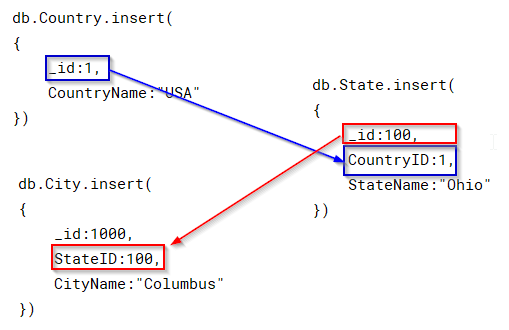

# MongoDB Collections Modeling

## MongoDB Collection with Flexible Schema
* Unlike SQL Database schemas MongoDB provides a **flexible Schema**
  ,by default, MongoDB **Collections** in a **Documents** do not require to 
  follow the same schema. 
* Below we create a collection test, with two documents with different schemas
```
use DocTesting

// Create Collection
db.createCollection("DocTest")

// Insert Unrelated Document with different schema in the same collection
db.DocTest.insert({"emp_id":1, "emp_name" : "ABC"})
db.DocTest.insert({"cats":"red", "dogs" : "blue"})

// Check data
db.DocTest.find()
```
>
* In practice, however, the documents in a collection conform to a common 
  schema, usually enforced by the client application code.
>


## MongoDB Collection with Embedded Data
* Embedded documents enforce relationships between Documents by storing 
  child and parent data in a single document structure.
* These are denormalized data models and enable calling applications to retrieve 
  and manipulate parent-child document data in a single call.
* The PARENT Data is the the dataset that encompasses the embedded CHILD data.
* In the below example we create 
  * `Parent Data` [_id, name, address, contact]
  * `Child Data` address: [HouseNumber, StreetName,City]
  * `Child Data` contact: [phone, email]
```
use DocTesting

// Create EmbeddedCollection
db.createCollection("EmbeddedCollection")

// Create Embedded Document
db.EmbeddedCollection.insert(
{
    _id: 100,
    name: "ABC",
    address: {
              HouseNumber: 100,
              StreetName: "xyz street",
              City: "New York"
              },
    contact: {
              phone:"111-111-1111",
              email:"aaa@bbb.ccc"
              }
}
)

// Retrive data
db.EmbeddedCollection.find()
```

>


## MongoDB Collection with References
* Object ID References enforce parent and child data by including the Parent 
  Collections ObjectID, in the Child Collection.
* This is the way Normalized data models can be implemented in MongoDB.
```
// Create Normalized Collections
// Parent
db.createCollection("Country")

// Child
db.createCollection("State")

// GrandChild
db.createCollection("City")

db.Country.insert(
{
    _id:1,
    CountryName:"USA"
})

db.State.insert(
{
    _id:100,
    CountryID:1,
    StateName:"Ohio"
})

db.City.insert(
{
    _id:1000,
    StateID:100,
    CityName:"Columbus"
})
```

>


## MongoDB Collection with Capped data
* Capped collections circular fixed size collections.
* Once the documents reach the specified size the oldest documents are 
  automatically deleted and the newest ones are inserted.
* Document insertion order is maintained this results in high performance.
* Capped Collections are very useful in the following scenarios
  * Implement a FIFO (First In, First Out) order queue with a limit.
  * Implement a data structure that guarantees stored data insertion order.
  * Implement documents with no updates.
  * Implement mechanism with auto delete, There is no provision for manual 
    delete of the docments from a capped collection.
  * There are no default indexes or _id column in a capped collection.
* Capped Collections provide TWO features, Capped in Byte Size, Providing any 
  number Mongo automatically makes it an nearest multiple of 256 integer
* Create A capped collection, By specifying capped: true and the size in Bytes.
  Here we specify 10 Power 6, thats 1 MB
```
db.createCollection("cappedColl_1",{capped:true, size:100000})
```
* Create a capped collection, by specifying, Byte Size and  
  max. number of collections
```
db.createCollection("cappedColl_2",{capped:true,size:100000, max:1000})
```
* Check if a collection is capped
```
db.cappedColl_2.isCapped()
```
* Convert a collection to capped.
```
db.createCollection("coll_3");
db.runCommand({"convertToCapped": "coll_3", size: 1000});
```
